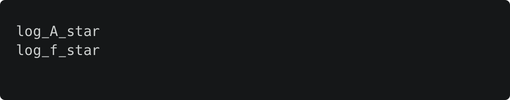
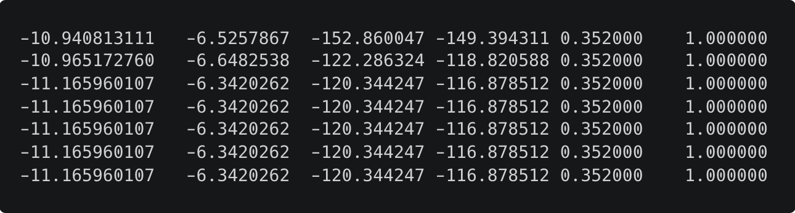
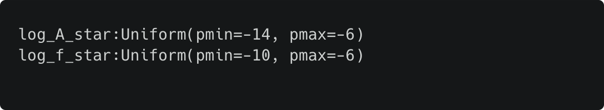

# Output
The structure of PTArcade outptut is the following
```{ .sh .no-copy }
out_dir/ # (1)!
└── name/ # (2)!
    └── chain_0/
        ├── chain_1.txt
        ├── pars.txt
        ├── priors.txt
        └── ...
```

1.  By default `out_dir = ./chains`. The user can specify a different 
output directory via the [configuration file][out].
2.  By default `name=np_model`. The user can specify a different 
name in the [model file][name].

The output generated by PTArcade matches that produced by [ENTERPRISE],
and it includes, beyond the MC chains, a number of files that summarize
key information on the run and the MC sampler. For our purposes here,
the most important files produced by PTArcade are:

[`pars.txt`](#+out.pars){ #+out.pars }

:   This file containt the names of the model parameters. The order in 
    which the parameters appear in this file will also dictate the orders 
    in which the parameters appear in the `chain_1.txt` file.

    When running with `mode="ceffyl"`, the `pars.txt` file for the example
    model discussed in the [introduction] will look like this: (1)
    { .annotate }

    1.  When running with `mode = "enterprise"`, in addition
    to the user-specified parameters, parameters will also include intrinsic
    red noise parameters (two per pulsar) and (in the case of the IPTA dataset)
    DM parameters. 

    

[`chain_1.txt`](#+out.chain){ #+out.chain }

:   This file contains the MC chains. And is formatted such taht each
    line represents a MC sample, and each column corresponds to a 
    parameter of our model. The ordering of the parameters (i.e. which 
    column is associated to each parameter can be read out from the 
    [`pars.txt`](#+out.pars) file). (1) 
    { .annotate }

    1.  Note that when running with `mode = "enterprise"`, in addition
    to the user-specified parameters, the chains will also include intrinsic
    red noise parameters (two per pulsar) and (in the case of the IPTA dataset)
    DM parameters. 

    In addition to the model parameters, the last four columns of each row 
    report the values of the posterior, likelihood, acceptance rate and 
    an indicator variable for [parallel tempering] (which does not matter 
    in our case since PTArcade does not use [parallel tempering]).

    For example, for the example model discussed in the [introduction] the 
    output of a run in Ceffyl mode will look like this 

    

    Here the first two coulmns give the values of $\log_{10}A_*$ and 
    $\log_{10}(f_*/{\textrm Hz})$, while the remaining columns give the 
    value of posterior, likelihood, acceptance rate and parallel tempering
    indicator.
    
[`priors.txt`](#+out.priors){ #+out.priors }

:   The prior file is similar to the `pars.txt` file, but in addition to 
the parameter names it also include their prior distributions. For our test
model, when running in Ceffyl mode, it looks like this

    

[out]: ./inputs/config.md#+config.out_dir
[name]: ./inputs/model.md#+model.name
[ENTERPRISE]: https://github.com/nanograv/enterprise
[introduction]: ./getting_started/index.md
[parallel tempering]: https://en.wikipedia.org/wiki/Parallel_tempering