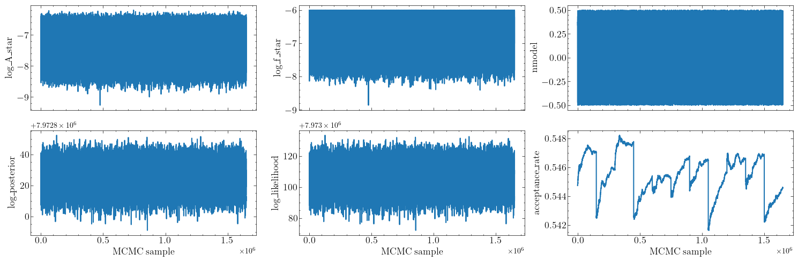

The [`plot_utils`][ptarcade.plot_utils] module contains functions that
 can be used plot the MCMC chains produced by PTAracade. In this page
we give some examples of the module functionalities, a more detailed
discussion can be found in its [reference page][ptarcade.plot_utils].

[`plot_chains`][ptarcade.plot_utils.plot_chains]

:   This function can be used to produce [trace plots][trace] plots
    of the chains. For example, let's say that you have a set of chains
    in `./out/model/`, you can produce their [trace plots][trace] as follows 

    ```python
    from ptarcade impor chain_utils as c_utils
    from ptarcade impor plot_utils as p_utils

    params, chain = c_utils.import_chains('./chains/np_model/')

    p_utils.plot_chains(chain, params)

    ```
which will produce the following 
<figure markdown>
  { width="800" }
</figure>

By default, [`plot_chains`][ptarcade.plot_utils.plot_chains] will olny produce
trace plots for the user specified parameters which are common across pulsars,
together with the trace plots for the MCMC parameters (likelihood, posterior, and
hypermodel index). If you want to plot trace plot for a different subset of the 
parameters you can do it by using the `params_name` argument. 

[`plot_posteriors`][ptarcade.plot_utils.plot_posteriors]

:   This function can be used to produce plosterior plots from MCMC chains. You 
    can use it as follows 

    ```python
    from ptarcade impor chain_utils as c_utils
    from ptarcade impor plot_utils as p_utils

    params, chain = c_utils.import_chains('./chains/np_model/')

    p_utils.plot_posteriors(chain, params)

    ```
    which will produce a plot like this 
<figure markdown>
  { width="600" }
</figure>


    


[trace]: https://www.statlect.com/fundamentals-of-statistics/Markov-Chain-Monte-Carlo-diagnostics#hid9